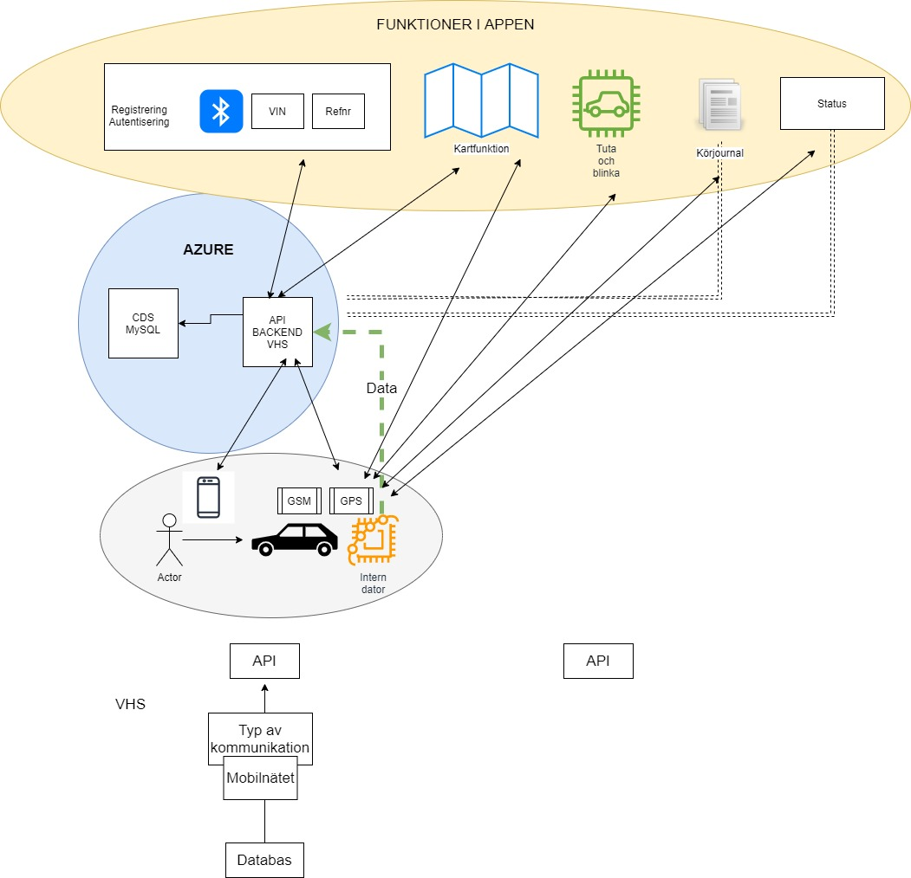
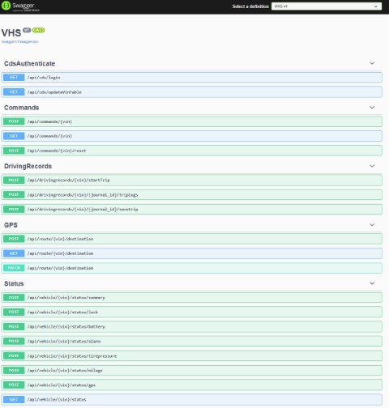

 

  
  <h3 align="center">Internet of Things System integration</h3>

    Project for a connected car - VHS
     
  

  
<h2 style="display: inline-block">Project Details</h2>

  <ol>
    <li><a href="#requirements">Requirements</a>
    <li><a href="#solution">Solution</a></li>
    <li><a href="#project-date">Project date</a></li> 
    <li><a href="#future-improvement">Future improvement</a></li>
    <li><a href="#acknowledgements">Acknowledgements</a></li>
  </ol>

---

## Requirements
Customers requirement is a holistic solution for a "CloudCar" concept where car owners would be able to use their app och connect with their cars. Our backend should deliver capabilities for that app such as:
* **Register and authenticate users** - validation happens against project owners custom database called CDS where all students have their test accounts
* **Navigation & Localize** - capability to track vehicles position and send coordinates to car navigation system
* **Honk & Flash** - send a *Honk&Flash* commando to the car in case the car owner cannot localize the car (car owner must be within 200 m radius)
* **Driving journal** - function that allows car owners to track the trip statistics such as
  * Distance
  * Energy usage
  * Average speed
* **Status** - car should be able to regularly send it's current data such as:
  * battery level
  * Position
  * Door status

Customer provided a *Customer Data System* against which our backend solution could authenticate potential car owner and check if they actually own a "CloudCar".

---

## Solution
1. VHSBackend.Web - REST API Controllers with endpoints
  *
  *
2. VHSBackend.Core - Core integration, SQL 
  *
  *
3. SQL Database run locally 
  * 
  * 
  *   

---

### Project date
november-december-2021

---

### Future improvement

---

### Acknowledgements
* [Kalle Johansson](https://github.com/MeltyMan)

